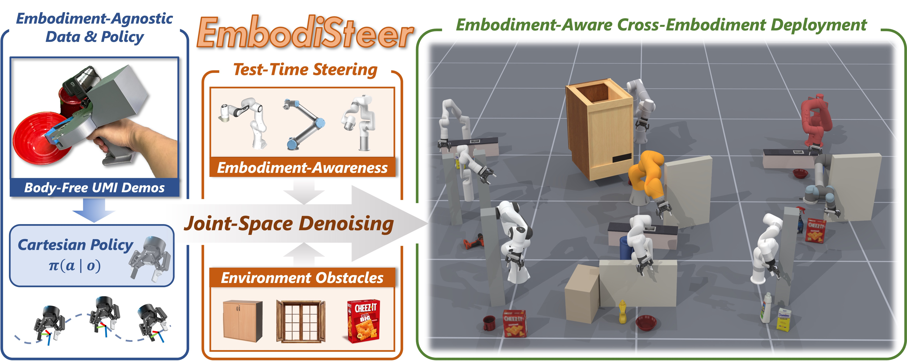
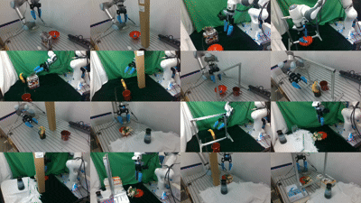

<h1 align="center">
  EmbodiSteer: Steering Embodiment-Agnostic Visuomotor Policies with Joint-Space Guidance for Zero-Shot Cross-Embodiment Deployment
</h1>

<p align="center">
  Shihefeng Wang<sup>*</sup>,
  Kangchen Lv<sup>*</sup>,
  <a href="https://mingrui-yu.github.io/">Mingrui Yu</a><sup>†</sup>,
  <a href="https://sites.google.com/view/homepageoflixiang/home">Xiang Li</a><sup>†</sup>
</p>

<p align="center">
  <sup>*</sup> Equal contribution &nbsp;&nbsp;
  <sup>†</sup> Co-corresponding authors
</p>

<p align="center">
  <a href="https://arxiv.org/abs/2606.12965">
    
  </a>
  <a href="https://frankwang67.github.io/EmbodiSteer-Page/">
    
  </a>
</p>

<p align="center">
  
  
</p>

EmbodiSteer is an inference-time steering framework for deploying a frozen embodiment-agnostic
Cartesian Diffusion Policy across robot embodiments. During denoising, the
policy state is lifted into the target robot's joint space, mapped through FK
and a damped Jacobian, and optionally corrected with cuRobo whole-body SDF
collision guidance.

This repository is a self-contained release tree. Simulation and physical
deployment use the same public policy package and versioned configuration.

Read [`docs/method.md`](docs/method.md) and
[`docs/installation.md`](docs/installation.md), then choose
[`docs/simulation.md`](docs/simulation.md) or
[`docs/real_world.md`](docs/real_world.md).

## 📰 News

- **2026.9.6** — The EmbodiSteer code is now open source!
- **2026.9.4** — Our paper has been accepted to **CoRL 2026**! 🎉

## 🗂️ Repository layout

This codebase primarily extends the
[Universal Manipulation Interface (UMI)](https://github.com/frankWang67/universal_manipulation_interface)
repository. The inherited components provide the Diffusion Policy stack and
the real-world hardware/data interfaces. EmbodiSteer adds its steering
algorithm on top of that foundation: simulation workflows depend on
[ManiSkill](https://github.com/mani-skill/ManiSkill), while the algorithm uses
[cuRobo](https://github.com/NVlabs/curobo) for robot kinematics and collision
queries. The supported fork revisions are recorded in
[`third_party/manifest.yaml`](third_party/manifest.yaml).

```text
EmbodiSteer/
├── embodisteer/              # public policies and reusable method components
├── diffusion_policy/         # Diffusion Policy model, data and training engine
├── umi/                      # real-device and data support
├── run_sim_pipeline.sh       # simple Conda wrapper for simulation workflows
├── run_sim_workflow.py       # primary simulation experiment interface
├── eval_sim_single_robot.py  # single-robot simulation evaluation
├── eval_sim_multi_robots.py  # multi-robot simulation evaluation
├── scripts_maniskill/        # simulation helpers and diagnostics
├── configs/workflows/        # config-driven data/train/evaluation workflow
├── scripts_real/             # real-device boundary and safety notes
├── scripts_slam_pipeline/    # data/SLAM preparation utilities
├── eval_real.py              # real-world evaluation entry point
├── third_party/              # dependency pins and asset provenance ledger
├── environment/              # environment and system requirements
├── tests/                    # CPU/layout tests and algorithm tests
└── docs/                     # release documentation
```

The two large external projects are not vendored here. Install the project
forks described in [`third_party/manifest.yaml`](third_party/manifest.yaml).
The ManiSkill and cuRobo entries are pinned to the commits recorded in the
manifest. Only those revisions are supported by the release scripts.

`diffusion_policy/` is a local model, data-loading and training engine. It is
kept API-compatible for checkpoint interoperability. All EmbodiSteer policy
implementations and reusable pose/Jacobian, SDF-reduction and CBF components
live under `embodisteer/`. Start with
[`embodisteer/policies/embodisteer.py`](embodisteer/policies/embodisteer.py)
to read the paper's denoising loop and CBF correction. See
[`docs/architecture.md`](docs/architecture.md) for the shared runtime boundary.

## 🧩 Public policy imports

The repository includes the paper method, joint-space and Cartesian guidance
comparisons, and the post-hoc baselines used in the benchmark. All of these
policies are exported from `embodisteer.policies`:

```python
from embodisteer.policies import DiffusionUnetTimmPolicyEmbodiSteer  # paper: CBF in joint space
from embodisteer.policies import EmbodiSteerEESpacePolicy            # Cartesian space policy: vanilla / GD
from embodisteer.policies import DiffusionUnetTimmPolicyJointSpace   # joint space policy: no guidance / GD
from embodisteer.policies import DiffusionUnetTimmPolicyBaseline     # post-hoc CBF / batch sampling
from embodisteer.policies import DiffusionUnetTimmPolicyJM2D         # JM2D
```

The available evaluation methods are:

- joint-space CBF: `DiffusionUnetTimmPolicyEmbodiSteer` (the paper method);
- joint-space no guidance or GD: `DiffusionUnetTimmPolicyJointSpace`;
- Cartesian vanilla or GD: `EmbodiSteerEESpacePolicy`;
- post-hoc CBF or batch sampling: `DiffusionUnetTimmPolicyBaseline`, selected
  by `baseline_method`; and
- JM2D conditional generation: `DiffusionUnetTimmPolicyJM2D`.

Checkpoints trained with the bundled Diffusion Policy model remain
interoperable: the evaluation launchers load their stored configuration and
weights, then use `runtime_config.policy_target` to select the concrete class
requested by the policy YAML before constructing the workspace. The public
`EmbodiSteerJointPolicy` alias denotes `DiffusionUnetTimmPolicyEmbodiSteer`
(CBF only), not the GD/no-guidance comparison class.

## ⚙️ Installation

See [`docs/installation.md`](docs/installation.md) for simulation and
real-robot setup instructions.

## 🎮 Simulation experiments

See [`docs/simulation.md`](docs/simulation.md) for detailed simulation
workflow, configuration, and evaluation instructions.

`run_sim_pipeline.sh` is the simplest interface for simulation experiments; it
enters the `embodisteer-sim` Conda environment and forwards all options to
`run_sim_workflow.py`. The Python workflow
orchestrates collection, conversion, validation, training, multi-profile
evaluation and result aggregation from one workflow YAML. The lower-level
`eval_sim_single_robot.py` and the retained convenience
`eval_sim_multi_robots.py` remain available for direct checkpoint probes.
Together with `eval_real.py`, they read algorithm settings from the same policy
YAML. The paper profile is
[`configs/policy/embodisteer.yaml`](configs/policy/embodisteer.yaml); the
Cartesian profile is [`configs/policy/ee.yaml`](configs/policy/ee.yaml).

```bash
python eval_sim_single_robot.py --help
python eval_sim_multi_robots.py --help
./run_sim_pipeline.sh --help
python eval_real.py --help
```

Checkpoint, environment, robot and output paths remain command-line arguments;
inference space, guidance/CBF/SDF, kinematic and baseline settings belong in the
policy YAML, including the Cartesian GD collision geometry and schedule. See
[`docs/policy_configuration.md`](docs/policy_configuration.md). Run simulation
only after installing the pinned ManiSkill fork and providing a compatible
checkpoint.

For a newly trained checkpoint, preview the complete simulation pipeline with:

```bash
./run_sim_pipeline.sh \
  --config configs/workflows/simulation.yaml --stage all --dry-run
```

The checked-in workflow targets `MakeIcedCoffee-v1`. After installing the
pinned ManiSkill/cuRobo forks, run the complete local workflow on a selected
GPU with:

```bash
CUDA_VISIBLE_DEVICES=0 ./run_sim_pipeline.sh \
  --config configs/workflows/simulation.yaml --stage all
```

To evaluate an existing checkpoint without recollecting data or retraining,
use the single-robot entry point:

```bash
CUDA_VISIBLE_DEVICES=0 python eval_sim_single_robot.py \
  --input /path/to/checkpoint.ckpt --ckpt_filename latest \
  --env_id MakeIcedCoffee-v1 \
  --robot_uids panda_robotiq_wristcam \
  --sim_backend physx_cpu --control_mode pd_joint_pos \
  --num_env 1 --num_eval_episodes 10 --steps_per_inference 8 \
  --obstacle \
  --policy-config configs/policy/make_iced_coffee/embodisteer.yaml
```

For a lightweight configuration check that does not require a checkpoint or
hardware, use:

```bash
python run_sim_workflow.py \
  --config configs/workflows/simulation.yaml --stage all --dry-run
```

The workflow separates collection, conversion, dataset validation, training
and evaluation into resumable stages. Its eval stage isolates every
profile/robot pair, writes `run_manifest.yaml`, `results.json`, `results.md`,
per-robot metrics and episode arrays, and supports `--resume`, `--force`,
`--checkpoint`, `--output-dir`, `--run-id` and `--robots`. Generated data,
checkpoints and results remain in gitignored or explicitly configured external
locations.

For another task, copy a workflow YAML into
`configs/workflows/<task>/`, change its task, artifact and evaluation fields,
then pass that file with `--config`; the shell script itself does not need to
be copied or edited. Set `EMBODISTEER_CONDA_ENV` only when using a Conda
environment with a different name.

## 🦾 Real-world experiments

See [`docs/real_world.md`](docs/real_world.md) for detailed hardware
configuration and deployment instructions.

Our real-world setup follows the hardware used by the
[UMI codebase](https://github.com/frankWang67/universal_manipulation_interface):
the same handheld gripper (with the mirror removed during our experiments) for data collection,
and UR5 / Franka Panda robot arms. The robot-mounted gripper differs from
UMI's WSG50: we use a Robotiq 2F-85.

The current real-world joint-space code selects cuRobo models for these two
arm–gripper combinations, with Robotiq as the default gripper:

- `robot_type: ur5` selects UR5 + Robotiq 2F-85 (`ur5_robotiq_umi.yml`).
- `robot_type: franka` selects Franka Panda + Robotiq 2F-85
  (`panda_robotiq_umi.yml`).

If you change either the robot arm or the gripper—for example, to UMI's
WSG50—you must add the corresponding robot model and collision configuration
in cuRobo and update the real-world model selection and gripper joint mapping
accordingly. Changing `robot_type` or `gripper_type` alone is not sufficient
for joint-space deployment. The original UMI WSG50 code is retained without
modification, but no WSG50 cuRobo model is configured in this release.

For data collection and robot-arm setup, please follow the UMI tutorials. For
adapting a Robotiq gripper to UMI, refer to the open-source assets linked from
[FastUMI](https://fastumi.com/), which include the Robotiq-related 3D models
used by this setup.

`eval_real.py` and `umi/real_world/` are included so the simulation and physical
deployment paths share the same policy package. `scripts_real/` documents the
intentional exclusion of duplicate, site-bound demos. Real robot execution
requires an approved emergency-stop procedure, controller and camera setup,
and explicit robot/gripper configuration. Never place credentials or
site-specific network addresses in a public config. The real-world path is not
a substitute for hardware safety validation.

## 📄 Scope and licensing

Checkpoint files, training data, wandb runs and large experiment outputs are
not part of this release tree. The repository includes Block Pushing and
Kitchen/Franka benchmark assets. Read
[`THIRD_PARTY_NOTICES.md`](THIRD_PARTY_NOTICES.md) and the machine-readable
[`third_party/assets.yaml`](third_party/assets.yaml) before redistributing
them. ManiSkill assets are CC BY-NC 4.0, and cuRobo is limited to
non-commercial research/evaluation under its NVIDIA License. The root
`LICENSE` does not replace any asset or external dependency terms.

Contribution and release-note conventions are documented in
[`CONTRIBUTING.md`](CONTRIBUTING.md) and [`CHANGELOG.md`](CHANGELOG.md).

## 🙏 Acknowledgement

We gratefully thank the authors and maintainers of the open-source projects
that make this work possible:

- [Universal Manipulation Interface (UMI)](https://github.com/frankWang67/universal_manipulation_interface)
  for the data-collection, visuomotor diffusion-policy implementation and real-world manipulation foundation;
- [ManiSkill](https://github.com/mani-skill/ManiSkill) for the simulation
  environments and benchmark infrastructure;
- [cuRobo](https://github.com/NVlabs/curobo) for robot kinematics and
  collision-query tools;
- [FastUMI](https://fastumi.com/) for the Robotiq gripper assets used to adapt
  the real-world setup.

## 📚 Citation

If you find EmbodiSteer useful in your research, please cite our paper.
Machine-readable paper citation metadata is also available in
[`CITATION.cff`](CITATION.cff).

```bibtex
@article{wang2026embodisteer,
  title   = {{EmbodiSteer}: Steering Embodiment-Agnostic Visuomotor Policies with Joint-Space Guidance for Zero-Shot Cross-Embodiment Deployment},
  author  = {Wang, Shihefeng and Lv, Kangchen and Yu, Mingrui and Li, Xiang},
  journal = {arXiv preprint arXiv:2606.12965},
  year    = {2026},
  url     = {https://arxiv.org/abs/2606.12965}
}
```
